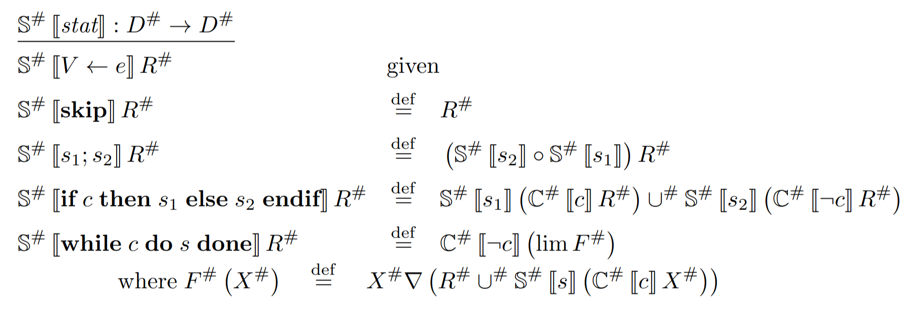
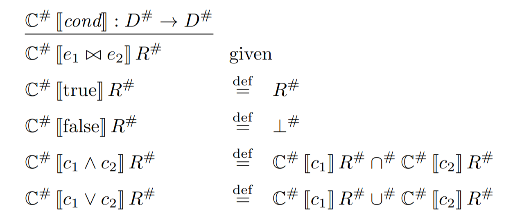

# While Analyzer

Static analyzer through abstract interpretation of source code written in the While language. 

The program automatically computes __sound__ numerical invariants from the input code, as in the output is guaranteed to be correct but most likely an approximation of the best possible invariants. 
Alarm flags are also raised for potential divisions by zero. This is also sounds, which means that false alarms are permitted in order to guarantee that no true alarms are missed.
This is achieved through induction on the abstract semantics of the program.

<!-- TODO:
- HC4-Revise should loop until convergence (either output or variables stable)
- Use constant propagation to extract widening thresholds
- Provide a web interface -->

The following grammars define the syntax of the language:

```
S :=                       # While language statements
  | x = e                  # assignment
  | skip                   # no-op
  | S1;S2                  # concatenation
  | if b then S1 else S2   # if then else
  | while b do S           # while loop

b :=          # Boolean expressions
  | true      # True constant
  | false     # False constant
  | e == e    # equality
  | e != e    # negated equality
  | e ≤ e     # less than or equal to
  | e < e     # less than
  | e ≥ e     # greater than or equal to
  | e > e     # greater than
  | not e     # negation
  | e and e   # logical AND
  | e or e    # logical OR

e :=            
  | x         # variable
  | n         # numeric constant
  | e1 op e2  # arithmetic operation
```

Input source files can optionally embed an initial abstract state, whose syntax is as:

```
var x: top, y: [-1, 1], z: bot;
```

Any missing variables will be automatically added with default value ```top```, meaning no information. Any redundant variable provided in the state will be ignored.

## Abstract Interpretation

The main idea behind abstract interpretation is that computing numerical invariants in the concrete domain is an undecidable problem, i.e., it may be impossible to compute it with an algorithm. This is why the analysis is performed through an abstract domain instead, which captures an approximation of the true invariants. These approximations need to be __sound__, which means that the hypothetical output of an analysis performed in the concrete domain, needs to be less defined (read provide more information) than the same analysis performed in an abstract domain.


The following are the abstract semantics of While statements and conditions, credits to [Antoine Miné](https://www.researchgate.net/profile/Antoine-Mine):





## Building From Source
Make sure to have Cabal installed, usually through [GHCup](https://www.haskell.org/ghcup/).
The code is compatible with Haskell Compiler GHC 9.10.1 and it can be compiled simply running:

```bash
cabal update
cabal install
```

Cabal will then place the executable in ```CABAL_DIR/bin```. On Linux this is usually ```~/.cabal/bin```.

## Usage
The compiler will then work as a CLI tool with the following usage:

```
Usage: while-analyzer-exec PATH [--m EXT_INT] [--n EXT_INT] 
                           [--widening_delay INT] [--descending_steps INT] 
                           [--abstract_domain STRING]
```

```PATH``` is a positional argument representing the path to the source file to analyze. A ```.while``` file extension is expected. The output will be placed in the same directory with the same name but extension ```.md```.
```--m``` and ```--n``` are two integer arguments which represent the lower and upper bounds for integers, used to parameterize the _Intervals_ abstract domain. Default to -inf, +inf.
```--widening_delay``` is how many Kleene iterations the analyzer should perform before applying widening.
```--descending_steps``` is how many Kleene iterations the analyzer should perform during narrowing.
```--abstract_domain``` is the abstract domain to use, currently only Intervals is supported.